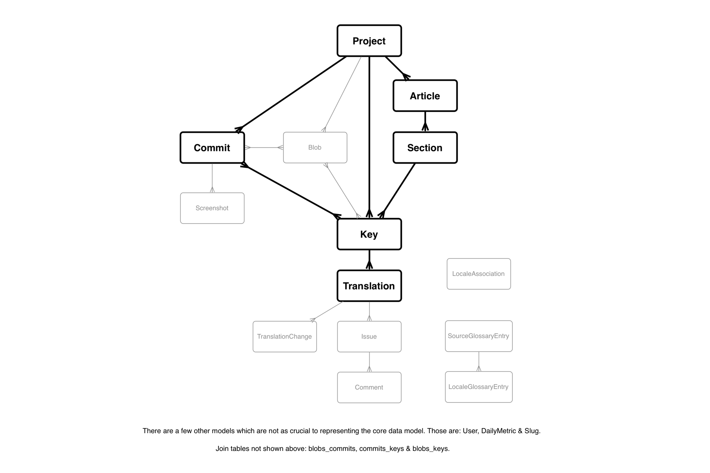

Shuttle: Magic localization dust 
================================

Shuttle is a website allowing for the automatic extraction and reintegration of
localizable strings in a code base. It also provides an API where articles can be
submitted for translation and retrieved. In addition, it provides a workflow for
translators and reviewers optimized for the efficient processing of many
strings. Finally, for project managers, it provides a dashboard allowing them to
view and manage the progress of a localization effort.

Shuttle can be thought of as a Continuous Integration system for translations.

One typical **Shuttle workflow** is as follows:

1. An engineer makes a commit to a Project, and marks that commit as requiring
   localization in Shuttle.
2. Shuttle scans the commit for any localizable strings using its {Importer}s.
3. New or modified localizable strings are marked as pending translation. They
   appear on the translators’ dashboard.
4. Translators translate all these strings. They then appear on the reviewers’
   dashboard.
5. Reviewers review and approve translations.
6. Once all translations applying to a commit are approved for all of a
   Project's required localizations, the Commit is marked as ready.
7. When the commit is deployed, Shuttle provides a manifest of translated
   strings that is downloaded as part of the deploy artifact.

Another typical **Shuttle workflow** is as follows:

1. An engineer makes an API call using a Project's api_token to submit a
   new {Article} (this can be an Article, Email, or anything else).
2. Shuttle parses the {Article}, splits it up into small pieces of strings.
3. Shuttle determines which strings need translation while optimizing for
   efficiency and accuracy. These strings appear on the translators’ dashboard.
4. Translators translate all these strings. They then appear on the reviewers’
   dashboard.
5. Reviewers review and approve translations.
6. Once all translations applying to a {Article} are approved for all of a
   Project's required localizations, the {Article} is marked as ready.
7. An engineer makes an API call to retrieve the translated Articles.

The whole process is extremely parallelizable: while one commit might be pending
translation or review, an engineer can make additional commits with new copy,
and they will also sit in the queue awaiting translation. Once any commit is
fully localized, it is marked as ready for release. This is true for
Articles as well, except, Shuttle doesn't keep versions for Articles and
any new submission will override the contents of the previous submission.

Shuttle will refuse to deliver a manifest for a commit or a Article that
has not been fully translated and reviewed. To prevent such deploys, engineers
should add a test to their CI script that ensures that the manifest endpoint
does not return 404.

Getting Started
---------------

### Starting the server

Developing for Shuttle requires Ruby 2.0.0, PostgreSQL, Redis, Tidy, Sidekiq Pro
ElasticSearch, and a modern version of libarchive. To run Shuttle for the first time:

1. Clone this project. You can run `brew bundle` to install all dependencies available 
   via Homebrew, which are specified in the `Brewfile`, or install them sequentially
   specified below.
   
2. Buy SidekiqPro, place your private repo url in Gemfile.

3. Install a modern version of libarchive, one that supports the GNU tar format.
   (The version that comes with Mac OS X does not.) On OS X, you can run

        brew install libarchive

   If you have an out-of-date libarchive version, you will see missing constant
   errors in the multifile exporters.
4. Create a PostgreSQL user called `shuttle`, and make it the owner of two
   PostgreSQL databases, `shuttle_development` and `shuttle_test`:

        brew install postgresql
        createuser shuttle
        createdb -O shuttle shuttle_development
        createdb -O shuttle shuttle_test

5. Install the libarchive gem using a modern version of libarchive.
   For Homebrew, run

        gem install libarchive -- --with-opt-dir=/usr/local/Cellar/libarchive/3.1.2

6. Install Redis and ElasticSearch. For Homebrew, run

        brew install redis elasticsearch

   and start them, following the post-install instructions for each of them.
7. Install Qt, the cross-platform application framework, which is used for capybara-webkit.
   For Homebrew, run

        brew install qt

8. You’ll need to run Bundler: `bundle install`
9. Run `rake db:migrate db:seed` to seed the database.
10. Run `RAILS_ENV=test rake db:migrate` to setup the test database.
11. Verify that all specs pass with `rspec spec`
12. To run the server, use `rails server`
13. To run the job queue: `bundle exec sidekiq -C config/sidekiq.yml`
to run the Sidekiq development server.
14. Visit [http://localhost:3000](http://localhost:3000) and log in with the
   credentials:

   username: **admin@example.com** 
   password: **password123**

### Adding your first project

You are now an admin user on Shuttle. You can click the "Add Project" button to
configure your first project. You will need at least read-only access to this
project's Git repository. Set up the locale and importing settings as neessary.

Once the project has been added, you can add a commit for it to import strings
from. For starters, try entering "HEAD". Once you click "Add", you should see
your Sidekiq server output start to fill up with importers processing all the
blobs in your HEAD commit. There may be a delay as the repository is checked out
to `tmp/repos` for the first time.

Refresh the Shuttle home page. When you click on your project name, it should
expand to show your commit. The progress bar should be orange and indeterminate,
indicating that the commit is being processed. Once processing is finished, the
Sidekiq log will quiet down and the progress bar should change to an empty
(white) bar, indicating that no translations have been made yet.

Click the progress bar to expand the commit and get detailed status information.
You should see three numbers. The badged number on the right is the total number
of translatable strings found in your project. Inside the progress bar are two
numbers separated by a slash. The first number is the number of finished
translations across all required locales (should be zero), and the second number
is the total number of required translations (should be the number of
translatable strings times the number of required locales, minus any keys that
are not applicable to certain locales).

The "Import and approve a localization" field allows you to import an existing
localization. For example, if your Rails project already has an "fr.yml" file
that you want to import into Shuttle (to save your translators the effort of
retyping all those translations), you can use this field to do it.

These are the features typically used by users with the "monitor" role. As an
admin you can also explore and use the tools used by translators: The
translation/review panel, the global search page, and the glossary. Managing
other users is an admin-specific feature.

One last important feature that admins have is the ability to visit the
"/sidekiq" URL, which lets them monitor and manage Sidekiq workers.

### Deploying to production

Shuttle does not come with a deploy script; you should use whatever deploy
system you are comfortable. Your deploy script should, in addition to copying
the code and starting the Rails server,

1. stop and restart the Sidekiq workers (the Sidekiq gem has many scripts for
   this), and
2. install the cron entries (the Whenever gem has scripts for this).

Documentation
-------------

Comprehensive documentation is written in YARD- and Markdown-formatted comments
throughout the source. To view this documentation as an HTML site, run
`rake yard`.

CoffeeScript libraries are documented using the YARD format as well, but YARD
does not as yet recognize them as documentable files. A `.codoopts` file is
included in case you wish to use [Codo](https://github.com/netzpirat/codo) to
generate the CoffeeScript docs, but as of now Codo does not recognize the ERb
files, and does not use the full set of Markdown syntax features used in the
documenttion.

Architecture
------------

### Models

Each {Project} has multiple {Commit Commits} or {Article Articles}.
When a Commit or Article is created, it is scanned by {Importer Importers} for
localizable strings. These strings are represented as {Translation} records.
A base Translation is created in the project's base locale, and preapproved,
and pending, untranslated Translations are created for each target locale.
These families of Translations are grouped under {Key} records, one for each
unique key in the Project. The newly created Translations are in the Project's
base locale. Future imports reuse the existing Keys if the source copy is unchanged,
otherwise generating new Keys and new Translations for the new source copy.
{User Users} with the translator role then fill out pending Translations, and
reviewers approve them.

When all of a Commit's/Article's Translations in all of a Project's required
locales are marked as approved, the Commit/Article is marked as ready.
This Commit's/Article's translated copy can then be exported to a manifest
file using an {Exporter}, or localized versions of project files can be
generated and downloaded using a {Localizer}.

Article keeps an ordered set of {Key Keys} whereas Commit keeps an unordered
set, so that the exporter can put the Translations back together in the right order.

Models make extensive use of advanced PostgreSQL features for efficiency and
convenience. Cached counters are updated using triggers and rules, foreign key
constraints and hooks are enforced at the database level, and validations are
backed up by corresponding `CHECK` triggers. This helps ensure referential and
data integrity even in situations where Rails fails, or outside of the Rails
stack. See the various migrations to learn more about the triggers, rules, and
constraints being used. See the `app/models/concerns` directory for the Active
Record mixins that leverage these PostgreSQL features.

Observers are used for more high-level triggers, such as sending emails. See the
classes in `app/models/observers` for more.

Issues, Comments and Screenshots make up a light-weight issue-tracking system,
and can be used by engineers and translators for easy communication and marking
issues translations (compare to email communication where you don't see the
previously raised issues in a translation unless you search for it on an external
system).

### Authentication and Authorization

Authentication is handled by Devise. Users log in using their email address and
a password.

Shuttle uses a role-based authorization system. See the {User} model for details
on the available user roles and their privileges.

### Controllers

For information about requests and responses, see {ApplicationController}.

### Views

This is a pretty typical Rails website, save for the views, which are written
using Erector. The views forgo the traditional Rails concepts of partials and
templates in favor of analogous OOP concepts more familiar to software
developers: methods and inheritance. All views inherit from an abstract Erector
widget which provides layout; and all views have their content split into
multiple private methods.

In addition to the usual helpers (in `app/helpers`), there are view mixins under
`app/views/additions` that simplify view coding.

JavaScript files are organized into four possible locations:

* Third-party JavaScript libraries are in `vendor/assets/javascripts` and
  loaded in the `application.js.coffee` manifest.
* JavaScript modules or helpers that are not specific to a particular page or
  site area are in `lib/assets/javascripts` and also loaded in
  `application.js.coffee`.
* JavaScript modules or helpers specific to a particular area of the site are in
  `app/assets/javascripts` and also loaded in `application.js.coffee`.
* Small JavaScript snippets, glue code, or other code intended to add dynamic
  behavior to a specific page is in a `.js` file named the same as, and placed
  alongside, the `.html.rb` view file. For example, if
  `app/views/projects/new.html.rb` needed a bit of JS glue code, it would be
  placed in `app/views/projects/new.js`. This code is placed in a `<SCRIPT>` tag
  at the end of the view by the `application.slim` layout.

CSS files are similarly organized:

* Third-party CSS files are in `vendor/assets/stylesheets` and loaded in the
   `application.css` manifest.
* CSS styles or helpers global to the entire website are in
  `lib/assets/stylesheets` and also loaded in `application.css`.
* CSS styles specific to a single page or a related group of pages are placed in
  `app/assets/stylesheets` and also loaded in `application.css`. Each `<BODY>`
  tag is given a class name equal to the controller name, and an ID equal to
  the controller and action name separated with a dash. For instance, the
  `projects/new` action's body would be `<body class=projects id=projects-new>`.

### Tasks

Various Rake tasks are available under `lib/tasks`. These include tasks for
importing locale data, bulk-importing trados data, server cleanup and other 
development tasks.

### Others

Shuttle also utilizes other design patterns such as:

* `Presenters` (layer between `Controllers` and `Views`),
* `Mediators` (layer between `Controllers` and `Models`),
* `Helpers` (for generating views)
* `Services` (to interact with other services or data stores such as Redis or ElasticSearch)

Distributed Processing
----------------------

Shuttle is designed to handle large code bases. Fast processing of these code bases is 
achieved through highly parallelizing common tasks which are expected to take a non-trivial 
amount of time, using Sidekiq. All Sidekiq workers live in `app/workers`. Best examples 
are CommitImporter and ArticleImporter. These both kick off sub-workers in a batch, 
and run other tasks when all the jobs in the batch are finished.

Importing and Exporting
-----------------------

Shuttle provides a number of importer and exporter libraries that are capable of
extracting strings or generating output in formats such as Rails i18n or iOS
.strings files. These classes are in `lib/importer` and `lib/exporter`.

Some i18n platforms require that localizations be split across multiple files;
normally, exporters only export a single file. To get around this restriction,
these exporters will export gzip-compressed tarballs that can be expanded into
the project's root directory.

### Localization of files with inline copy

While importers can scan an entire project for localizable strings, exporters
are built on the assumption that the exported file will contain only translated
strings, and no other content or metadata. This will not work with, for example,
xib files, which must be duplicated in their entirety (with the localized copy
substituted for the original copy).

Shuttle handles this process with file localization. Importers that work with
localizers (rather than exporters) also record metadata about where in the
file the string came from. A localizer (under `lib/localizer`) recreates
the original file and substitutes translated copy using the source information.

### Key inclusion and exclusion lists

Certain keys can be excluded by a blacklist or whitelist system. These settings
are spread about a couple of different places:

**Project-global key exclusions and inclusions**: The `key_exclusions` and
`key_inclusions` metadata fields on Project are used to control global key
whitelisting or blacklisting. Only one or the other should be set.

**Locale-specific key exclusions and inclusions**: The `key_locale_exclusions`
and `key_locale_inclusions` metadata fields on Project are used to control key
whitelisting or blacklisting on a locale-by-locale basis. For each locale, only
a whitelist or a blacklist should be set.

**Commit-specific key exclusions**: If a particular commit has a `.shuttle.yml`
file in the project root, it is read and the value `key_exclusions` key is used
to further filter keys. It should be an array of keys or UNIX-style globs. This
allows developers to exclude keys on a certain branch until that branch is ready
for translation. Note that Keys belong to a Project and have a many-to-many
relationship with Commits. Therefore, keys matching a commit-specific exclusion
will still be imported, but will simply not be associated with the commit
currently being processed. Because of this, no locale-specific exclusions are
supported in this manner.

**Project-global path filtering**: The `only_paths` and `skip_paths` metadata
fields on Project are used to prevent the importer from descending into certain
paths.

**Importer-specific path filtering**: The `only_importer_paths` and
`skip_importer_paths` metadata fields on Project are used to prevent certain
importers from descending into specific paths.

See {Project#skip_key?}, {Project#skip_path?}, and {Commit#skip_key?} for more
information.

Fencing
-------

Fencing is the act of marking off portions of text as untranslatable (for
example, HTML tags). These portions can be moved but not altered or deleted, in
most cases. Fencing can also be used to mark off interpolation variables, such
as `%{count}` in the Ruby i18n format.

A variety of fencers for common formats is provided under `lib/fencer`; they are
not subclasses of an abstract superclass, but do all respond to the same
informal interface.

Specs
-----

All models, controllers, and library files are unit or integration-tested with 
RSpec specs under the `spec` directory. Run unit tests with the `rspec spec` 
command. Views and JavaScript files are not specced. Almost all unit tests use 
factories rather than mocks, putting them somewhat closer to integration tests.

To-Do Items
-----------

### Translation view

* Display meta-indication of special characters, esp. nonprinting ones

### Explosions

* Token object
* Token explosions (UI)
* Language metadata

### Large-format translation view

* Git context display

### Finish account administration

* Design and verify Devise account pages

### Importing

* Segmentation for large files
* `<STYLE>`/`<SCRIPT>` tag content should not be localizable

### Performance optimizations

* Use PSQL trigger-based cached counters

### Misc.

* Second reviewer role: integration review (by commit) (?)
